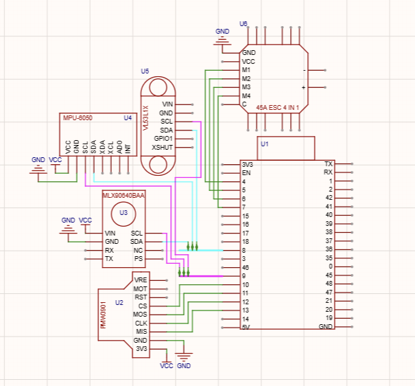

13/06/206 10:09 pm
 first ever log for the drone, i have already created the schematic, though i will need to continue creating the drones
 pcb to hold the parts which may take a long time. So lets start by discussing the parts of the drone

  I currently use a JMT X4 310MM X4M310L FIBERGLASS, i choosed this not because of practicality but because i already have this within inventory.
  And I have also decided to use a X2807 1300KV Uangel + 7040 GEMFAN triblade + 4s 3300mah 4s 60c, the reason for these components is mainly due to 
  control and flight time, using a 4s could enable me to lower cost by buying a 45A esc 4-in-1, at the same time it could have a longer flight time
  enough to showcase the drones capabilities.

14/06/2026 9:35
  Below me is the schematic for the drone, which includes the parts needed for it to be full automated, so lets start one by one.
  for this dorone i will be using a ESP32-S3-WROOM-N16R8-1 as the flight control, and i will be using a 45A esc 4-in-1.
  
   SENSORS:
    MPU6050 - this acts as the IMU which will be determining the yaw, roll, and pitch. i may not be using the accelonometer as vibrations cause drift
  
  
